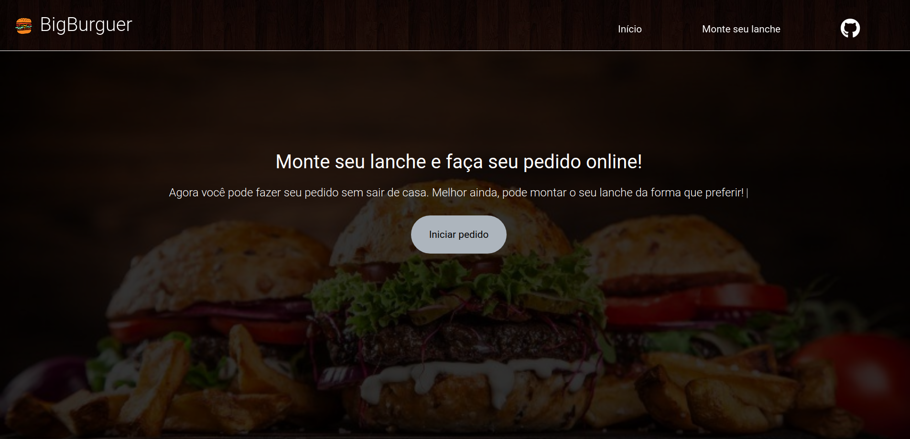
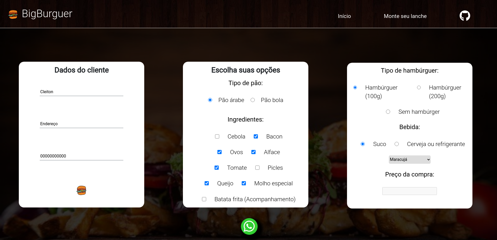
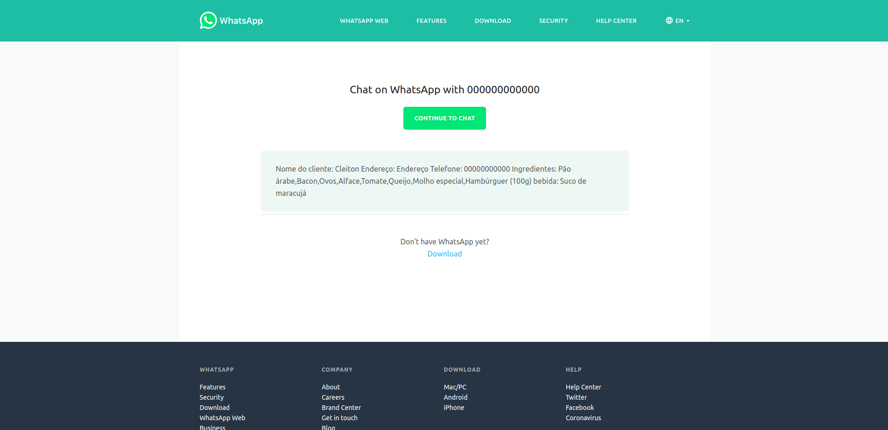

<h1 align="center">🍔 BigBurguer</h1>

## 📘 Sobre

este projeto consiste em um website que atua como um cardápio virtual, onde é possível você montar o seu próprio lanche e pedi-lo através do WhatsApp.

<h2 align="center">📎 Acesse o site <a href="https://bigburguer.herokuapp.com/" target="_blank">aqui</a></h2>

 

## 📑 Tabela de conteúdo

   * [Sobre]()
   * [Tabela de Conteúdo]()
   * [Como usar]()
   * [Tecnologias]()
   * [Autor]()

   <h2 align="center"> 🚧  Finalizado  🚧</h4>

   ## 👨‍💻 Como usar

   
A interface do site, feito com HTML e SCSS, é super intuitiva e prática, possuindo somente uma tela inicial com um menu logo abaixo, acessível através do botão "Iniciar pedido".

   

   
Já ao iniciar o pedido, logo após preencher algumas informações necessárias, você poderá montar o seu lanche com as seguintes opções e escolher uma bebida.

   

   
Após preencher tudo, perceba que há um botão no footer da página, e é através dele que o pedido será enviado através da API do WhatsApp.

   

   ## 💻 Tecnologias

